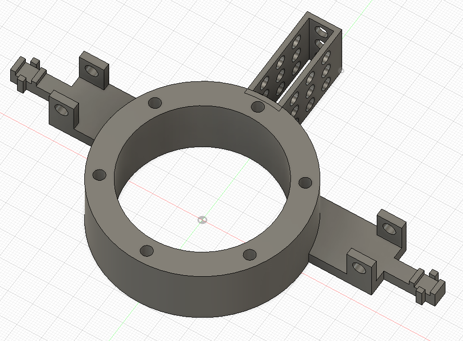
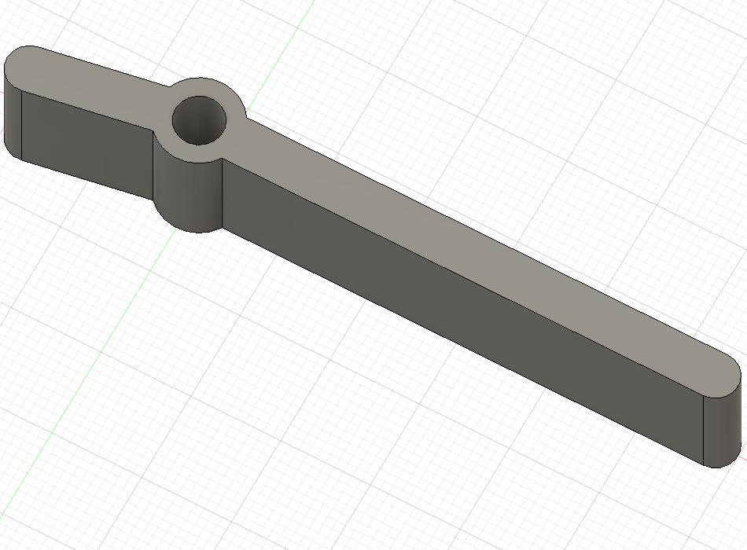

# tinygo-ffb-steering-wheel

TinyGo 用のコードを置く予定。  

## paddle shifter

[SWITCHSCIENCE/DIY-FFB-Wheel](https://github.com/SWITCHSCIENCE/DIY-FFB-Wheel) にパドルシフターを追加するためのものです。  
必要なものは以下の通り。  

| パーツ | 必要個数 |
| -- | -- |
| [./models/paddle_shifter/](body.stl) | 1 |
| [./models/paddle_shifter/](lever.stl) | 1 |
| M5 x 30mm | 2 |
| [タクトスイッチ](https://akizukidenshi.com/catalog/g/gP-01282/) | 2 |

* [./models/paddle_shifter/](./models/paddle_shifter)

